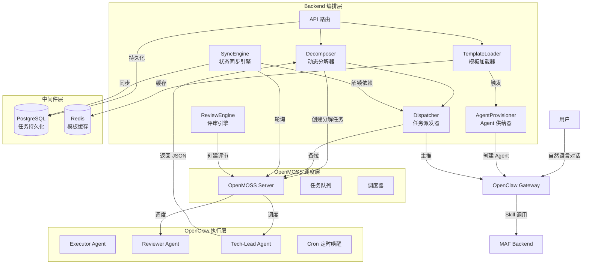
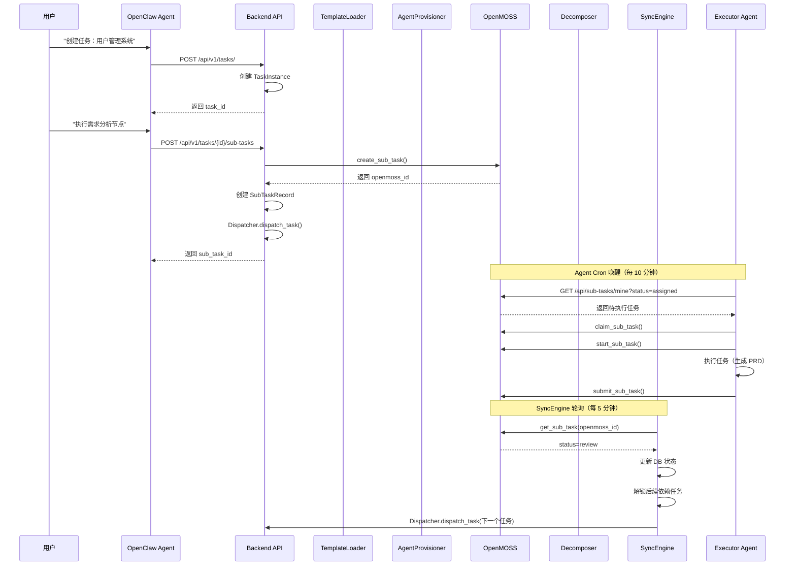
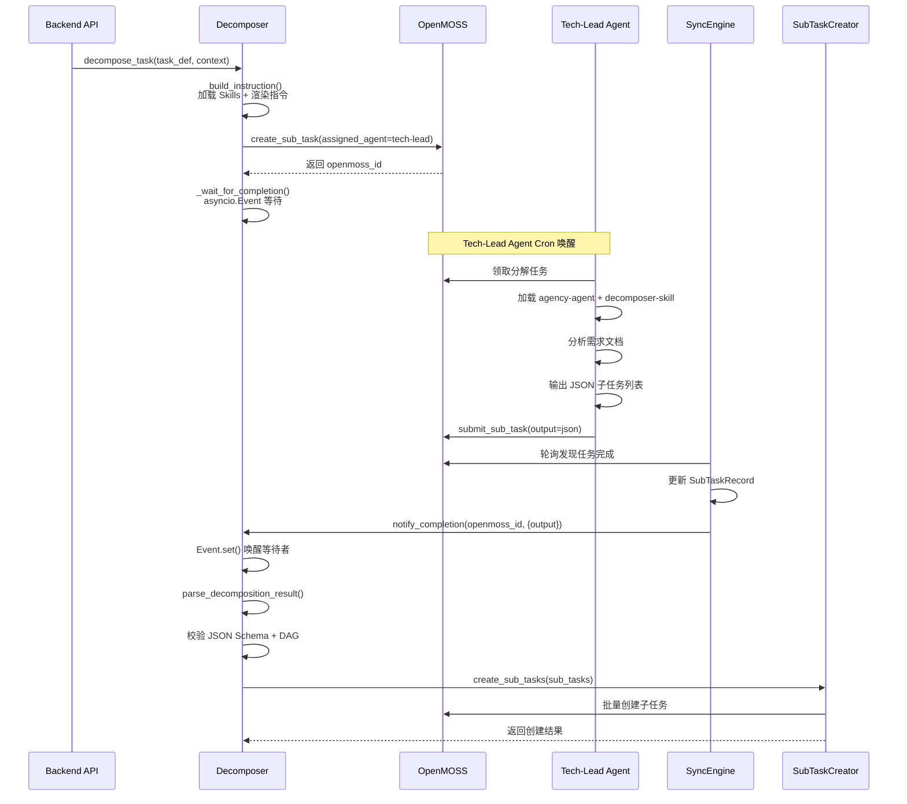
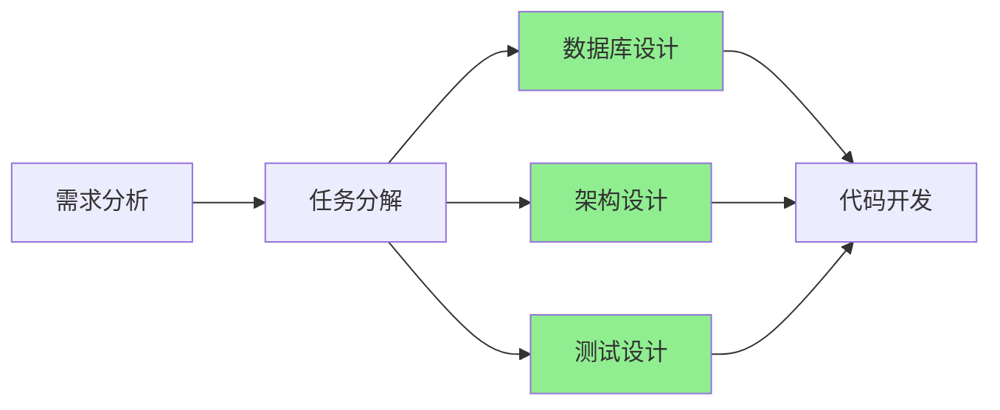
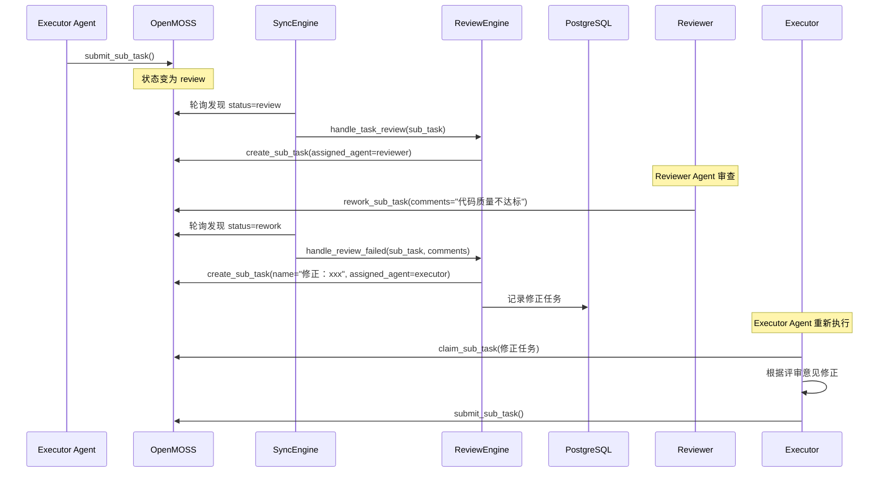
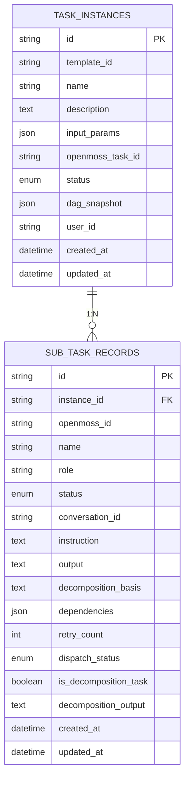

# 07-概要设计文档

> **文档用途**：完整描述 multi-agent-flow 系统的设计全貌，包括系统架构、核心流程、数据设计、API 接口、实现逻辑及未来迭代规划。
> **维护规则**：本文档为系统级设计文档，重大架构变更需经架构组评审后更新。

---

## 1. 概述

### 1.1 系统定位

**Multi-Agent-Flow (MAF)** 是一个企业级多智能体协同平台，通过 YAML 模板定义任务流程，由 Backend  orchestration、OpenMOSS 任务调度、OpenClaw Agent 执行三层架构协同工作，实现从需求到交付的自动化研发流程。

### 1.2 设计原则

| 原则 | 说明 |
|:---|:---|
| **职责分离** | Backend（编排）/ OpenMOSS（调度）/ OpenClaw（执行）严格分工 |
| **推拉结合** | 主推（OpenClaw API 实时注入）+ 备拉（OpenMOSS 轮询）双保险 |
| **事件驱动** | asyncio.Event 驱动异步等待，避免轮询浪费资源 |
| **DAG 快照** | 任务实例化时保存 DAG 快照，执行过程不受模板更新影响 |
| **Skill 热加载** | 支持运行时动态加载 Skill，无需重启 Agent |

### 1.3 技术栈

| 层级 | 技术选型 | 版本 |
|:---|:---|:---|
| **Backend** | Python + FastAPI + SQLAlchemy | Python 3.11+ |
| **数据库** | PostgreSQL + Redis | PG 15+ / Redis 7+ |
| **任务调度** | OpenMOSS | v1.1.3+ |
| **Agent 执行** | OpenClaw Lobster | 2026.4.9+ |
| **DAG 引擎** | networkx | 3.2.1+ |
| **模板监控** | watchdog | 4.0.0+ |

---

## 2. 系统架构

### 2.1 整体架构图



### 2.2 组件职责

| 组件 | 职责 | 关键接口 |
|:---|:---|:---|
| **TemplateLoader** | 监控 templates/ 目录，加载 YAML 模板，校验 DAG，触发 Agent 供给 | `load_template()`, `get_template()` |
| **AgentProvisioner** | 探测缺失 Agent，创建 Agent，发送入职包，配置 Cron | `ensure_role_exists()`, `send_onboarding_package()` |
| **Decomposer** | 通过 OpenMOSS 启动 Agent 分解任务，解析 JSON，校验 Schema/DAG | `decompose_task()`, `parse_decomposition_result()` |
| **Dispatcher** | 推拉结合派发任务，主推失败降级为备拉 | `dispatch_task()`, `dispatch_batch()` |
| **SyncEngine** | 定期轮询 OpenMOSS 状态，同步到 DB，解锁依赖任务 | `start_sync_loop()`, `sync_sub_task()` |
| **ReviewEngine** | 创建评审任务，处理通过/驳回，创建修正任务 | `handle_task_review()`, `handle_review_failed()` |
| **SkillLoader** | 动态加载 SKILL.md 文件，构建 System Prompt | `load_skills()`, `build_system_prompt()` |

### 2.3 部署架构

#### 2.3.1 Docker 容器拓扑

```
┌─────────────────────────────────────────────────────────────┐
│                      maf-net (Bridge)                       │
│                                                             │
│  ┌──────────────┐  ┌──────────────┐  ┌──────────────────┐  │
│  │   Backend    │  │   OpenMOSS   │  │  OpenClaw GW     │  │
│  │  :8000       │  │   :6565      │  │  :18789          │  │
│  └──────┬───────┘  └──────┬───────┘  └────────┬─────────┘  │
│         │                 │                    │            │
│  ┌──────▼───────┐  ┌──────▼───────┐            │            │
│  │  PostgreSQL  │  │    Redis     │            │            │
│  │   :5432      │  │   :6379      │            │            │
│  └──────────────┘  └──────────────┘            │            │
│                                                │            │
│  ┌─────────────────────────────────────────────▼─────────┐  │
│  │               Shared Volume: /workspace               │  │
│  │  /workspace/{task_id}/  (Task ID 隔离)                │  │
│  └───────────────────────────────────────────────────────┘  │
└─────────────────────────────────────────────────────────────┘
```

#### 2.3.2 环境变量清单

| 变量名 | 说明 | 默认值 | 必填 |
|:---|:---|:---|:---:|
| `PROJECT_NAME` | 项目标识 | `maf` | ✅ |
| `OPENMOSS_BASE_URL` | OpenMOSS 地址 | `http://openmoss:6565` | ✅ |
| `OPENCLAW_BASE_URL` | OpenClaw 地址 | `http://openclaw-gateway:18789` | ✅ |
| `DATABASE_URL` | PostgreSQL 连接串 | `postgresql+asyncpg://...` | ✅ |
| `REDIS_HOST` | Redis 主机 | `redis` | ✅ |
| `OPENMOSS_REGISTRATION_TOKEN` | Agent 注册令牌 | `default-registration-token` | ✅ |
| `SKILLS_DIR` | Skills 目录路径 | `/app/skills` | ❌ |

#### 2.3.3 ⚠️ 红线清单（严禁操作）

| 红线 | 后果 | 替代方案 |
|:---|:---|:---|
| ❌ 直接修改数据库 | 破坏数据一致性 | 通过 Backend API 操作 |
| ❌ 删除 Docker 网络 | 服务间通信中断 | 使用 `docker network inspect` 排查 |
| ❌ 修改 /workspace 权限 | Agent 无法读写文件 | 保持 755 权限 |
| ❌ 跳过 Agent 注册流程 | Agent 无法获取 Token | 使用 `register_agents.py` 脚本 |
| ❌ 手动修改 Redis 缓存 | 模板状态不一致 | 通过 TemplateLoader API 更新 |

---

## 3. 核心流程设计

### 3.1 正向调用时序图



### 3.2 动态节点处理时序图



### 3.3 并行节点执行



**并行执行逻辑**：
1. SyncEngine 检测到 B 完成
2. 查询 DAG 快照，找出 C1/C2/C3 均依赖 B
3. 检查 C1/C2/C3 的其他依赖（无）
4. 同时派发 C1/C2/C3 到不同 Agent
5. 三个任务独立执行，互不阻塞
6. 任一完成后，检查 D 的所有依赖是否完成
7. C1/C2/C3 全部完成后，解锁 D

### 3.4 异常处理时序图



---

## 4. 数据设计

### 4.1 表关系图



### 4.2 表定义说明

#### 4.2.1 task_instances（任务实例表）

| 字段 | 类型 | 说明 |
|:---|:---|:---|
| `id` | String(36) | UUID 主键 |
| `template_id` | String(36) | 关联的模板 ID（可为空） |
| `name` | String(255) | 任务名称 |
| `description` | Text | 任务描述 |
| `input_params` | JSON | 模板输入参数（如 `{"project_name": "xxx"}`） |
| `openmoss_task_id` | String(36) | OpenMOSS 中的父任务 ID |
| `status` | Enum | 任务状态：pending/in_progress/completed/failed/cancelled |
| `dag_snapshot` | JSON | **DAG 完整快照**（实例化时保存，执行过程不受模板更新影响） |
| `user_id` | String(36) | 创建用户 ID |
| `created_at` | DateTime | 创建时间 |
| `updated_at` | DateTime | 更新时间 |

#### 4.2.2 sub_task_records（子任务记录表）

| 字段 | 类型 | 说明 |
|:---|:---|:---|
| `id` | String(36) | UUID 主键 |
| `instance_id` | String(36) | 所属任务实例 ID（外键） |
| `openmoss_id` | String(36) | OpenMOSS 中的子任务 ID |
| `name` | String(255) | 子任务名称 |
| `role` | String(50) | 执行角色（executor/reviewer/tech-lead） |
| `status` | Enum | 子任务状态：pending/assigned/in_progress/review/done/rework/blocked/failed |
| `conversation_id` | String(255) | OpenClaw 会话 ID |
| `instruction` | Text | 任务指令（包含 Skills 内容） |
| `output` | Text | 执行结果（产出文件路径） |
| `decomposition_basis` | Text | 分解依据（仅动态任务） |
| `dependencies` | JSON | 依赖的子任务 ID 列表（如 `["task-1", "task-2"]`） |
| `retry_count` | Integer | 重试次数 |
| `dispatch_status` | Enum | 派发状态：pushed/pending_pull/failed |
| `is_decomposition_task` | Boolean | 是否为动态分解任务 |
| `decomposition_output` | Text | 分解任务返回的 JSON |
| `created_at` | DateTime | 创建时间 |
| `updated_at` | DateTime | 更新时间 |

**索引优化**：
- `idx_subtask_instance`: 按 instance_id 查询（高频）
- `idx_subtask_status`: 按 status 查询（SyncEngine 轮询）

### 4.3 数据流图

```
用户创建任务
    ↓
Backend 创建 TaskInstance (status=pending)
    ↓
Backend 创建 SubTaskRecord (status=assigned, openmoss_id=xxx)
    ↓
Dispatcher 派发任务 → OpenClaw (Push) / OpenMOSS (Pull)
    ↓
Agent 执行任务 → 提交到 OpenMOSS (status=review)
    ↓
SyncEngine 轮询 OpenMOSS → 更新 SubTaskRecord (status=review)
    ↓
ReviewEngine 创建评审任务 → Reviewer Agent 审查
    ↓
审查通过 → OpenMOSS (status=done)
    ↓
SyncEngine 轮询 → 更新 SubTaskRecord (status=done)
    ↓
SyncEngine 解锁依赖任务 → 检查所有依赖是否完成
    ↓
Dispatcher 派发下一个任务
    ↓
所有子任务完成 → 更新 TaskInstance (status=completed)
```

---

## 5. API 接口说明

### 5.1 Backend API

#### 5.1.1 健康检查

```
GET /api/v1/health
```

**响应**：
```json
{
  "status": "ok",
  "service": "Multi-Agent-Flow Backend",
  "version": "0.1.0",
  "database": "connected"
}
```

#### 5.1.2 创建任务

```
POST /api/v1/tasks/
```

**请求体**：
```json
{
  "name": "用户管理系统",
  "description": "开发用户管理系统",
  "template_id": "simple-dev-flow",
  "input_params": {
    "project_name": "用户管理系统",
    "tech_stack": "FastAPI + Vue3"
  }
}
```

**响应**：
```json
{
  "id": "a7b13e97-2eac-4a0d-9018-07da637f906c",
  "name": "用户管理系统",
  "status": "pending",
  "template_id": "simple-dev-flow",
  "created_at": "2026-04-25T03:42:48.658245"
}
```

#### 5.1.3 创建子任务

```
POST /api/v1/tasks/{task_id}/sub-tasks
```

**请求体**：
```json
{
  "name": "需求分析",
  "role": "product-manager",
  "instruction": "请分析用户需求，输出 PRD 文档",
  "dependencies": []
}
```

**响应**：
```json
{
  "id": "sub-task-001",
  "instance_id": "a7b13e97-...",
  "name": "需求分析",
  "role": "product-manager",
  "status": "assigned",
  "dispatch_status": "pushed",
  "created_at": "2026-04-25T03:42:48.658245"
}
```

#### 5.1.4 子任务完成汇报

```
POST /api/v1/tasks/{task_id}/sub-tasks/{sub_task_id}/complete
```

**请求体**：
```json
{
  "status": "done",
  "output_path": "/workspace/{task_id}/req-analysis/prd.md",
  "message": "PRD 文档已完成"
}
```

#### 5.1.5 模板管理

```
GET    /api/v1/templates/          # 获取模板列表
GET    /api/v1/templates/{id}      # 获取模板详情
POST   /api/v1/templates/          # 创建模板
DELETE /api/v1/templates/{id}      # 删除模板
POST   /api/v1/templates/{id}/instantiate  # 实例化模板
```

### 5.2 OpenMOSS API

#### 5.2.1 创建子任务

```
POST /api/sub-tasks
Headers: X-Agent-Key: {planner_token}
```

**请求体**：
```json
{
  "task_id": "parent-task-id",
  "name": "需求分析",
  "description": "## Active Skills\n...\n\n## Instruction\n...",
  "acceptance": "- 输出 PRD 文档",
  "priority": "medium",
  "type": "once",
  "assigned_agent": "executor"
}
```

**响应**：
```json
{
  "id": "om-xxx",
  "status": "assigned"
}
```

#### 5.2.2 查询子任务状态

```
GET /api/sub-tasks/{sub_task_id}
Headers: X-Agent-Key: {planner_token}
```

**响应**：
```json
{
  "id": "om-xxx",
  "status": "done",
  "output": "任务执行结果",
  "deliverable": "/workspace/xxx/output.md"
}
```

#### 5.2.3 Agent 注册

```
POST /api/agents/register
Headers: X-Registration-Token: {reg_token}
```

**请求体**：
```json
{
  "name": "executor-001",
  "role": "executor",
  "description": "Executor agent for multi-agent-flow"
}
```

**响应**：
```json
{
  "id": "agent_001",
  "role": "executor",
  "api_key": "sk_executor_xxx"
}
```

### 5.3 OpenClaw API

#### 5.3.1 消息注入（主推模式）

```
POST /api/v1/message
Headers: Authorization: Bearer {gateway_token}
```

**请求体**：
```json
{
  "channel": "api",
  "message": "## Active Skills\n...\n\n## Instruction\n...",
  "conversation_id": "task_xxx_sub_yyy",
  "wait_for_response": false
}
```

#### 5.3.2 创建 Agent

```
POST /api/agents
Headers: Authorization: Bearer {gateway_token}
```

**请求体**：
```json
{
  "name": "executor-agent",
  "model": "qwen3.6-plus",
  "workspace": "/workspace/executor-agent"
}
```

#### 5.3.3 配置 Cron

```
POST /api/cron
Headers: Authorization: Bearer {gateway_token}
```

**请求体**：
```json
{
  "id": "executor-poll",
  "agent": "executor-agent",
  "schedule": "*/10 * * * *",
  "message": "Wake up and execute assigned tasks."
}
```

---

## 6. 详细实现逻辑说明

### 6.1 TemplateLoader（模板加载器）

**核心逻辑**：
1. 使用 `watchdog` 监控 `templates/` 目录
2. 文件变更时防抖动处理（默认 1 秒）
3. 读取 YAML → Pydantic 校验（含 DAG 循环检测）
4. 存入 Redis 缓存（key: `template:{template_id}`）
5. 触发 `AgentProvisioner.ensure_role_exists()` 创建缺失 Agent

**关键代码**：
```python
def load_template(self, file_path: str) -> bool:
    data = yaml.safe_load(file_path)
    template = TemplateSchema(**data)  # 校验 DAG
    redis_client.set(f"template:{template.template_id}", template.model_dump())
    self._trigger_agent_provisioning(template.model_dump())
```

### 6.2 AgentProvisioner（Agent 供给器）

**核心逻辑**：
1. 检查 OpenMOSS 中是否已存在该角色 Agent
2. 不存在则调用 OpenClaw API 创建 Agent
3. 发送入职包（提示词 + CLI 工具 + 注册令牌 + Skills）
4. 配置 Cron 定时唤醒任务

**入职包内容**：
```markdown
# 欢迎入职！
你是 **{role_name}** 角色。

## 1. 更新提示词
{prompt}

## 角色能力 (Skills)
{skills_section}

## 2. 下载工具
{cli_tool}

## 3. 自动注册
Token: `{reg_token}`

## 4. Workspace 使用规范
...
```

### 6.3 Decomposer（动态分解器）

**核心逻辑**：
1. 构建完整指令（加载 Skills 内容 + 渲染 Instruction）
2. 创建分解任务到 OpenMOSS（assigned_agent=tech-lead）
3. 使用 `asyncio.Event` 等待 Agent 完成
4. 解析 JSON 输出（容错：提取 Markdown 代码块）
5. 校验 JSON Schema + DAG 循环依赖
6. 注入元数据（required_skills, output_format）

**Event 驱动等待**：
```python
async def _wait_for_completion(self, openmoss_id: str) -> Dict:
    event = asyncio.Event()
    self.completion_events[openmoss_id] = event
    await asyncio.wait_for(event.wait(), timeout=self.timeout)
    return self.completion_results.pop(openmoss_id, {})
```

### 6.4 Dispatcher（任务派发器）

**推拉结合机制**：
```python
async def dispatch_task(self, ...):
    try:
        # 主推：实时调用 OpenClaw API
        await self._push_to_openclaw(conversation_id, instruction)
        return {"status": "pushed"}
    except Exception:
        # 备拉：等待 Agent Cron 轮询
        await self._pull_fallback(openmoss_id, role)
        return {"status": "pending_pull"}
```

### 6.5 SyncEngine（状态同步引擎）

**核心逻辑**：
1. 每 5 分钟轮询 OpenMOSS 中所有进行中的子任务
2. 状态映射：OpenMOSS 状态 → 本地枚举
3. 如果任务完成：
   - 动态分解任务 → 通知 Decomposer
   - 普通任务 → 解锁后续依赖
4. 解锁逻辑：检查所有依赖是否完成 → 更新状态 → 派发任务

### 6.6 SkillLoader（技能加载器）

**安全修复**：
- P0-1: 使用 `Path.relative_to()` 防止路径边界绕过
- P0-3: 改为实例级缓存，避免多实例共享
- P1-1: 使用 `os.fstat()` 在打开文件后检查大小，防止 TOCTOU
- P1-2: 递归改迭代 + `max_depth=100` 限制
- P1-5: YAML 炸弹防护（`yaml.safe_load`）

**缓存机制**：
```python
def _load_skill_content(self, skill_path: str) -> str:
    if skill_path in self._content_cache:
        return self._content_cache[skill_path]
    
    # 检查文件大小（TOCTOU 防护）
    self._check_file_size_safe(skill_path)
    
    with open(skill_path, 'r') as f:
        content = f.read()
    
    # LRU 淘汰
    if len(self._content_cache) >= MAX_CACHE_SIZE:
        oldest_key = next(iter(self._content_cache))
        del self._content_cache[oldest_key]
    
    self._content_cache[skill_path] = content
    return content
```

---

## 7. 预留及未来迭代内容

### 7.1 当前预留功能

| 功能 | 状态 | 说明 |
|:---|:---|:---|
| **模板级 Skill 覆盖** | 预留 | 支持在 YAML 模板中定义 `role_skill_overrides` 覆盖全局默认 |
| **完整实例化逻辑** | TODO | `POST /templates/{id}/instantiate` 当前返回模拟数据 |
| **告警集成** | TODO | `ErrorHandler._alert_admin()` 待集成邮件/钉钉/企业微信 |
| **Dashboard 前端** | 未开始 | Vue3 + Element Plus + ECharts |
| **自然语言意图识别** | 未开始 | LLM 识别用户意图并路由到对应 API |

### 7.2 未来迭代方向

#### Phase 1：完整功能开发（4 周）
- [ ] Vue3 Dashboard 前端
- [ ] 自然语言意图识别
- [ ] 并行执行支持（完善）
- [ ] 部分通过逻辑
- [ ] 性能分析与监控

#### Phase 2：安全与优化（2 周）
- [ ] JWT 认证系统
- [ ] RBAC 权限模型
- [ ] 审计日志系统
- [ ] 性能优化（连接池、缓存策略）

#### Phase 3：自反馈优化（2 周）
- [ ] 指标收集（执行时间、成功率）
- [ ] 根因分析
- [ ] 模板自动优化
- [ ] Skill 知识库沉淀

### 7.3 技术债清单

| 技术债 | 优先级 | 说明 |
|:---|:---:|:---|
| `importlib` 动态导入 | P1 | `agent_provisioner.py`/`decomposer.py`/`sub_task_creator.py` 中使用 `importlib` 导入 `loader.py`，应改为标准包导入 |
| `agent_provisioner` 全局单例 | P2 | 应改为工厂模式或依赖注入 |
| 测试覆盖不足 | P1 | 缺少集成测试和端到端测试 |
| 日志规范不统一 | P2 | 部分使用 `print`，部分使用 `logging` |

---

*文档版本：1.0.0*
*最后更新：2026-04-27*
*维护人：架构组*